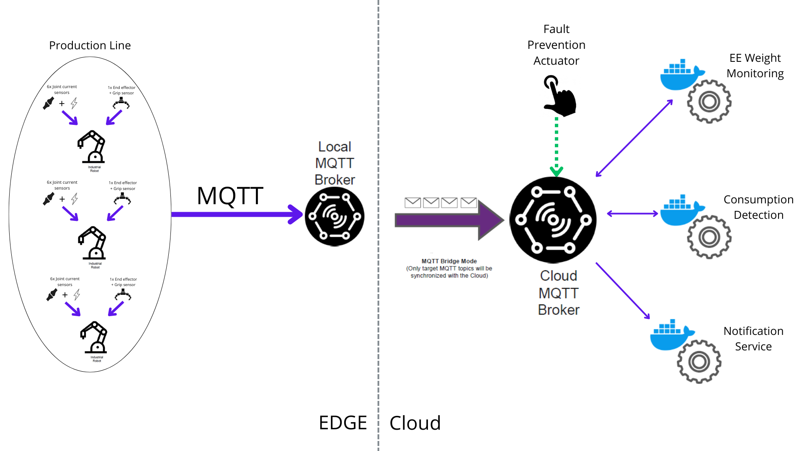
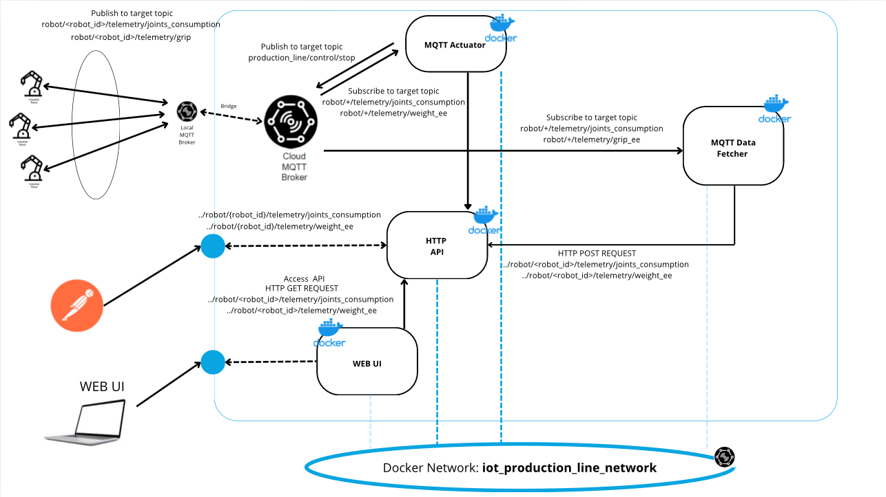

# IoT Microservice Architecture for Production Line Monitoring

This project demonstrates the implementation of a robust IoT Microservices Architecture specifically designed to monitor and manage a production line consisting of multiple robotic arms. By leveraging the power of microservices and containerization technologies, this architecture provides a flexible, scalable, and maintainable solution for real-time data collection, analysis, and system management. The architecture ensures high efficiency and seamless integration, making it ideal for dynamic and evolving industrial environments.



## Project Structure

The system consists of several key components, each responsible for specific functionalities to ensure seamless
integration and operation:

- ### MQTT Local Broker
  Positioned close to the production line, the **MQTT Local Broker** collects data from the robotic arms and forwards it
  to the **Cloud Broker**. This ensures low-latency communication and efficient data handling within the production
  environment.
- ### MQTT Cloud Broker
  The **MQTT Cloud Broker** serves as a central hub for data aggregation, receiving messages from the Local Broker and
  distributing them to subscribed clients.
- ### HTTP-API
  The **http-api** module, accessed via an HTTP API, manages key robotic arm metrics such as:
  The weight supported by the end effector and the power consumption for each robotic arm joint.
- ### MQTT Data Fetcher
  This microservice bridges MQTT communication with the **IoT Inventory API**. It subscribes to MQTT topics, processes
  incoming telemetry data, and interacts with the HTTP-API System. Additionally, it converts grip sensor values into
  weight measurements, enabling precise load tracking.
- ### Web UI
  A user-friendly **Web Interface** provides real-time visualization of the production line. Key features include:
  - Displaying the power consumption of individual robotic arm joints.
  - Showing the weight currently supported by each robotic arm's end effector.
  - Showing the faults detected by the Fault Prevention Actuator.
- ### Fault Prevention Actuator
  This microservice analyzes data to proactively prevent faults or issues in robotic arms. When the consumption of any joint of any robot in the production line exceeds a certain threshold abnormally, it automatically stops the production line via an MQTT connection.

## Overall Structure



# Execution/Run Details

### Docker Network Setup

Since we are going to deploy multiple containers, we need to create a dedicated network to allow communication between
them.
**In this way containers can communicate with each other using the container name as the hostname.**

Create a Docker network to allow the containers to communicate with each other:

```bash
  docker network create iot_production_line_network
```

In order to connect a container to a network, you can use the following parameter
`--network iot_iot_production_line_network` at the run time:

```bash
  docker run --name=<container_name> --network iot_production_line_network <other_options> <image_name>
```

## Starting the Docker Network

To start the entire Docker network, follow the steps below:

1. **Navigate to the `docker-compose` directory:**

   ```bash
   cd docker-compose
   ```

2. **Build the images for all the microservices**:
   Before running the Docker network, you need to build the images for all the microservices. Please refer to the README file of each microservice for instructions on how to build the images.
   - [MQTT Data Fetcher README](/data-fetcher/README.md)
   - [MQTT Cloud Broker README](/mqtt-cloud-broker/README.md)
   - [HTTP-API README](/http-api/README.md)
   - [Web UI README](/web-ui/README.md)
   - [Fault Prevention Actuator README](/fault-prevention-actuator/README.md)
3. **Start the containers**:
   Once the images are built, you can bring up all the containers using the following command:

```bash
  docker-compose up -d
```

This will start the entire network of containers defined in the docker-compose.yml file.

## Starting the MQTT Local Broker Setup - Eclipse Mosquitto

This guide outlines how to set up and customize an MQTT broker using **Eclipse Mosquitto**. We use the official
`eclipse-mosquitto` Docker image (version `2.0.12`) available on Docker Hub.

When setting up the broker, the following custom configurations are applied:

- Mount a local `mosquitto.conf` file
- Mount a local folder for persistent data storage
- Mount a local folder for logs
- Map the default MQTT port `1883`
- Port mapping: `-p 1883:1883`
- Restart always: `--restart always`
- Daemon mode: `-d`

**Steps to Set Up the Local Broker**

1. **Navigate to the MQTT Local Broker Directory**
   ```bash
   cd mqtt-local-broker
   ```
2. **Run the Docker Container**

   ```bash
    docker run --name=my-mosquitto-broker \
    -p 1883:1883 \
    -v ${PWD}/mqtt-local-broker/mosquitto_local.conf:/mosquitto/config/mosquitto.conf \
    -v ${PWD}/docker-compose/data:/mosquitto/data \
    -v ${PWD}/docker-compose/log:/mosquitto/log \
    --restart always \
    -d eclipse-mosquitto:2.0.12
   ```
