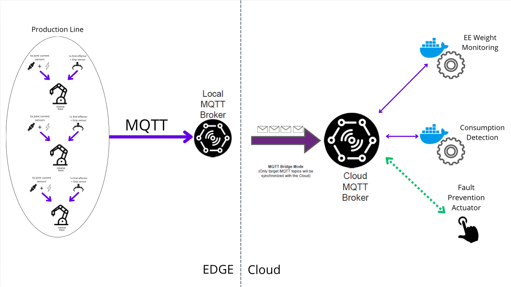
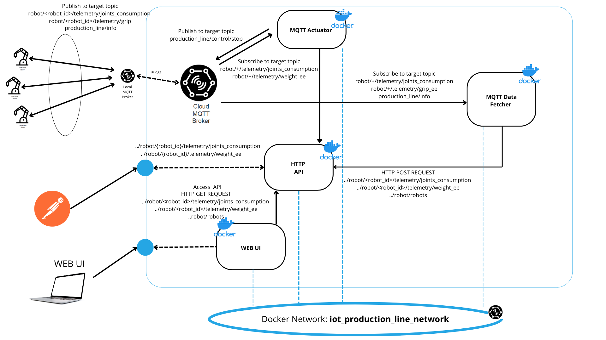

# [IoT Microservice Architecture for Production Line Monitoring](https://iot-microservices-architecture-pl.my.canva.site)

<p align="center">
  
</p>

## Introduction

This project demonstrates the implementation of a robust IoT Microservices Architecture specifically designed to monitor
and manage a production line consisting of multiple robotic arms. By leveraging the power of microservices and
containerization technologies, this architecture provides a flexible, scalable, and maintainable solution for real-time
data collection, analysis, and system management. The architecture ensures high efficiency and seamless integration,
making it ideal for dynamic and evolving industrial environments.



## Project Structure

The system consists of several key components, each responsible for specific functionalities to ensure seamless
integration and operation:

- ### [MQTT Local Broker](/mqtt-local-broker/README.md)

  Positioned close to the production line, the **MQTT Local Broker** collects data from the robotic arms and forwards it
  to the **Cloud Broker**. This ensures low-latency communication and efficient data handling within the production
  environment.

- ### [MQTT Cloud Broker](/mqtt-cloud-broker/README.md)

  The **MQTT Cloud Broker** serves as a central hub for data aggregation, receiving messages from the Local Broker and
  distributing them to subscribed clients.

- ### [HTTP-API](/http-api/README.md)

  The **http-api** module, accessed via an HTTP API, manages key robotic arm metrics such as:
  The weight supported by the end effector and the power consumption for each robotic arm joint.

- ### [MQTT Data Fetcher](/data-fetcher/README.md)
  This microservice bridges MQTT communication with the **IoT Inventory API**. It subscribes to MQTT topics, processes
  incoming telemetry data, and interacts with the HTTP-API System. Additionally, it converts grip sensor values into
  weight measurements, enabling precise load tracking.
- ### [Web UI](/web-ui/README.md)
  A user-friendly **Web Interface** provides real-time visualization of the production line. Key features include:
  - Displaying the power consumption of individual robotic arm joints.
  - Showing the weight currently supported by each robotic arm's end effector.
  - Showing the faults detected by the Fault Prevention Actuator.
- ### [Fault Prevention Actuator](/fault-prevention-actuator/README.md)
  This microservice analyzes data to proactively prevent faults or issues in robotic arms. When the consumption of any
  joint of any robot in the production line exceeds a certain threshold abnormally, it automatically stops the
  production line via an MQTT connection.

### Overall Structure



## Execution & Run Details

### Create a Docker Network

Since we are going to deploy multiple containers, we need to create a dedicated network to allow communication between
them. In this way containers can communicate with each other using the container name as the hostname.
Create a Docker network to allow the containers to communicate with each other:

```bash
docker network create iot_production_line_network
```

In order to connect a container to a network, you can use the following parameter --network
iot_iot_production_line_network at the run time:

```bash
docker run --name=<container_name> --network iot_production_line_network <other_options> <image_name>
```

### Bridge and Brokers Setup

#### Local Broker IP Address Configuration

In order to connect the Local Broker to the Cloud Broker, you need to specify the IP address of the Cloud Broker in the mosquitto_local.conf file. You can find the mosquitto_local.conf file in the mqtt-local-broker directory. Open the file and replace the value of the variable address with the IP address of the Cloud Broker.

```bash
  address <cloud_broker_ip>
```

#### Cloud Broker IP Address Configuration

To connect the Cloud Broker to the Local Broker, you need to specify the Local Broker's IP address in the mosquitto_cloud.conf file. This file can be found in both the mqtt-cloud-broker and docker-compose directories. Open these files and replace the value of the address variable with the Local Broker's IP address.

```bash
  address <local_broker_ip>
```

#### Set up the images

These steps will guide you through setting up the Docker images for the MQTT Local Broker and MQTT Cloud Broker.

- Navigate to the desired microservice directory, for example, mqtt-local-broker.

```bash
  cd mqtt-local-broker
```

- Build the Docker image: Execute the following command to build the Docker image for the microservice. This command will:
  - Use the Dockerfile to define the image's configuration.
  - Create a Docker image with the specified name and tag.

```bash
  docker build -t mqtt-local-broker .
```

Repeat this process for each microservice to build the corresponding Docker images. Be sure to navigate to the correct directory for each microservice before executing the docker build command.

#### Starting the Docker Microservices

Navigate to the Docker Compose Directory

```bash
cd docker-compose
```

Run the Docker Compose Command: Execute the following command to start the Docker containers. This command will:

- Create and start the Docker containers for all the microservices.
- Use the docker-compose.yml file to define the services and their configurations.
- Connect the containers to the iot_production_line_network network.

```bash
docker-compose up -d
```

#### Starting the Production Line Simulation

These steps will guide you through starting the production line simulation.

- Navigate to the Production Line Simulation Directory

```bash
cd mqtt-production-line
```

- Run the Production Line Consumer Script. This command will:
  - Run the production_line_consumer.py script, which enables receiving stop messages via MQTT.

```bash
python production_line_consumer.py
```

- Run the Production Line Producer Script. This command will:
  - Run the production_line_producer.py script, which simulates the production line by sending MQTT messages to the Local Broker.

```bash
python production_line_producer.py
```

And that's it! You have successfully set up the IoT Microservices Architecture for Production Line Monitoring. You can now monitor the production line in real-time and proactively prevent faults or issues in the robotic arms.
