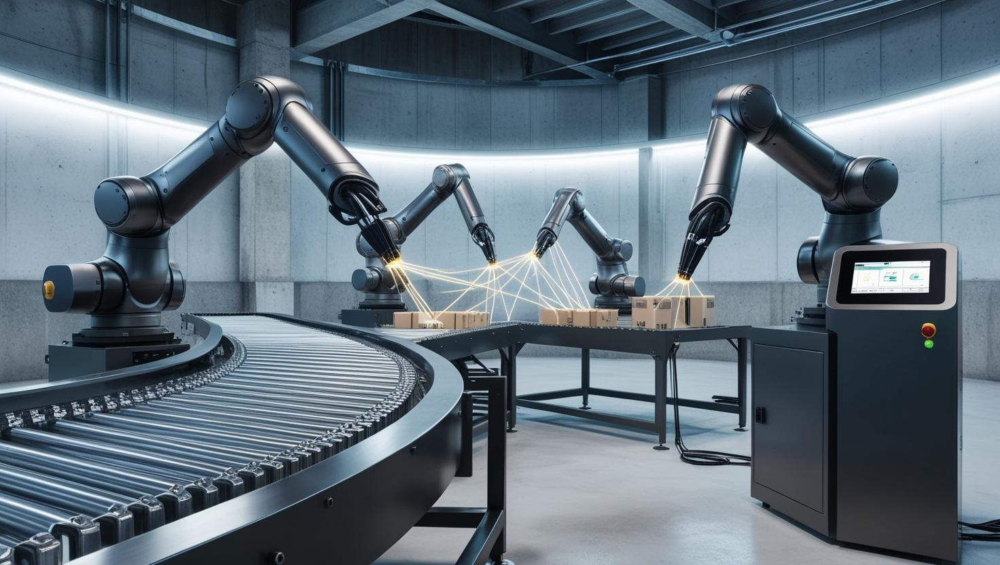

  

# IoT Microservice Architecture for Production Line Monitoring

## Introduction

This project demonstrates the implementation of a robust IoT Microservices Architecture specifically designed to monitor and manage a production line consisting of multiple robotic arms. By leveraging the power of microservices and containerization technologies, this architecture provides a flexible, scalable, and maintainable solution for real-time data collection, analysis, and system management. The architecture ensures high efficiency and seamless integration, making it ideal for dynamic and evolving industrial environments.

## Project Structure

The system consists of several key components, each responsible for specific functionalities to ensure seamless
integration and operation:

- ### [MQTT Local Broker](/mqtt-local-broker/README.md)
  Positioned close to the production line, the **MQTT Local Broker** collects data from the robotic arms and forwards it
  to the **Cloud Broker**. This ensures low-latency communication and efficient data handling within the production
  environment.

- ### [MQTT Cloud Broker](/mqtt-cloud-broker/README.md)
  The **MQTT Cloud Broker** serves as a central hub for data aggregation, receiving messages from the Local Broker and
  distributing them to subscribed clients.

- ### [HTTP-API](/http-api/README.md)
  The **http-api** module, accessed via an HTTP API, manages key robotic arm metrics such as:
  The weight supported by the end effector and the power consumption for each robotic arm joint.

- ### [MQTT Data Fetcher](/data-fetcher/README.md)
  This microservice bridges MQTT communication with the **IoT Inventory API**. It subscribes to MQTT topics, processes
  incoming telemetry data, and interacts with the HTTP-API System. Additionally, it converts grip sensor values into
  weight measurements, enabling precise load tracking.
- ### [Web UI](/web-ui/README.md)
  A user-friendly **Web Interface** provides real-time visualization of the production line. Key features include:
  - Displaying the power consumption of individual robotic arm joints.
  - Showing the weight currently supported by each robotic arm's end effector.
  - Showing the faults detected by the Fault Prevention Actuator.
- ### [Fault Prevention Actuator](/fault-prevention-actuator/README.md)
  This microservice analyzes data to proactively prevent faults or issues in robotic arms. When the consumption of any joint of any robot in the production line exceeds a certain threshold abnormally, it automatically stops the production line via an MQTT connection.

### Overall Structure

## Execution & Run Details

