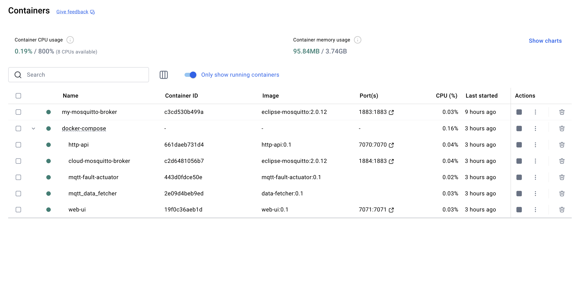

# IoT Production Line - Docker Compose

This project uses Docker Compose to orchestrate the services needed for our IoT application. Specifically, it includes an MQTT broker, an HTTP API, a web UI, an MQTT data fetcher, and an MQTT fault actuator. All services are containerized, allowing them to interact with each other over an isolated network. This setup simplifies the system configuration and makes it more scalable.

## Services

### 1. **cloud-mosquitto-broker**

- **Docker Image**: `eclipse-mosquitto:2.0.12`
- **Description**: MQTT broker for communication between IoT devices.
- **Exposed Port**: `1884:1883` (port 1883 of the container is mapped to port 1884 on the host machine).
- **Volume**: Custom MQTT configuration from the file `./mosquitto_cloud.conf`.
- **Network**: Part of the `iot_production_line_network`.

This service enables communication between our Dockerized application and the local application simulating the assembly line. It uses the default MQTT bridge functionality to link the local broker with the cloud broker.

[Cloud broker README](/mqtt-cloud-broker/README.md)

### 2. **http-api**

- **Docker Image**: `http-api:0.1`
- **Description**: HTTP API for interacting with the IoT system.
- **Exposed Port**: `7070:7070`.
- **Volume**: Custom configuration from the file `./target_api_conf.yaml`.
- **Network**: Part of the `iot_production_line_network`.

This service facilitates interaction between the web UI and the other services. It hosts the Flask application and API resources, defining the Data Transfer Objects (DTOs) and resources for the application. To ensure the service works correctly, we have also set up the Postman application for testing the API endpoints.

[HTTP-API README](/http-api/README.md)

### 3. **web-ui**

- **Docker Image**: `web-ui:0.1`
- **Description**: Web interface for visualizing the data.
- **Exposed Port**: `7071:7071`.
- **Volume**: Configuration for the web interface from the file `./target_web_conf.yaml`.
- **Dependencies**: Depends on the `http-api` service.
- **Network**: Part of the `iot_production_line_network`.

This service provides the user interface to monitor and interact with the system. It's built with Flask and fetches telemetry data from the HTTP API, displaying it using HTML templates.

[WEB-UI README](/web-ui/README.md)

### 4. **mqtt_data_fetcher**

- **Docker Image**: `data-fetcher:0.1`
- **Description**: Service that collects data from the MQTT broker and processes it.
- **Volume**: Configuration from the file `./target_fetcher_conf.yaml`.
- **Dependencies**: Depends on the `cloud-mosquitto-broker` and `http-api` services.
- **Network**: Part of the `iot_production_line_network`.

This component acts as an intermediary between the MQTT broker and the HTTP-based API. Its main function is to subscribe to telemetry MQTT topics, process incoming messages, and interact with the HTTP API as needed.

[Data Fetcher README](/data-fetcher/README.md)

### 5. **mqtt-fault-actuator**

- **Docker Image**: `mqtt-fault-actuator:0.1`
- **Description**: Actuator that takes action on the collected data, potentially in response to malfunctions or system events.
- **Volume**: Configuration from the file `./target_actuator_conf.yaml`.
- **Dependencies**: Depends on the `cloud-mosquitto-broker` service.
- **Network**: Part of the `iot_production_line_network`.

This service analyzes the data coming from the `mqtt_data_fetcher` microservice. When a robot reaches a critical wear level, it publishes a stop command on the appropriate MQTT topic and notifies the user through the web UI and the relevant HTTP API. The cloud broker then redirects teh stop command to the production line.

[Fault Prevention Actuator README](/fault-prevention-actuator/README.md)

## Network

All services are connected to the `iot_production_line_network`, which uses the `bridge` driver for container communication.

## Images

