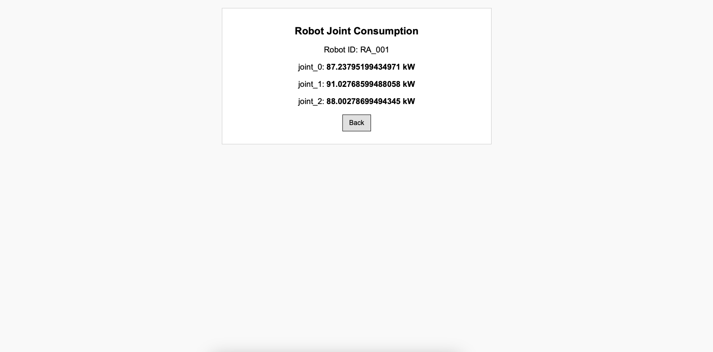
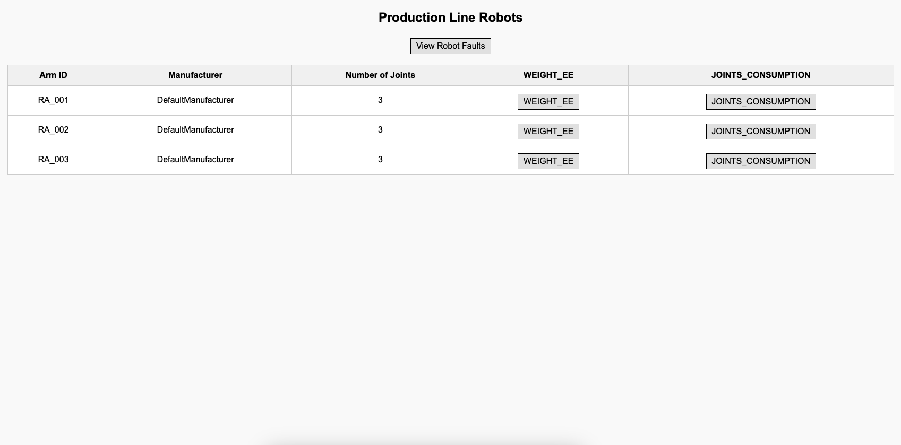

# Web UI Microservice

## Introduction

The Web UI microservice provides a Flask-based web interface for visualizing telemetry data from robotic systems and monitor the Fault logs of the actuator. It fetches telemetry data from an HTTP API and displays it using HTML templates.

## Features

- Fetches and displays joint consumption telemetry.
- Fetches and displays weight capacity telemetry.
- Fetches and displays fault messages.
- Configurable via YAML configuration files.
- Runs as a Docker container.
- Supports deployment with Docker Compose.

## Directory Structure

```
web-ui/
│── app/
│   ├── templates/
│   │   ├── joint_consumption.html
│   │   ├── weight_ee.html
│   ├── web_server.py
│   ├── web_server_process.py
│── Dockerfile
│── README.md
│── requirements.txt
│── target_web_conf.yaml
│── web_conf.yaml
```

## Configuration

The service uses YAML configuration files to set up host, port, and API endpoints.

### Example `web_conf.yaml`

```yaml
web:
  host: "0.0.0.0"
  port: 7071
  api_base_url: "http://127.0.0.1:7070/api/v1/productionline"
```

### Example `target_web_conf.yaml`

```yaml
web:
  host: "0.0.0.0"
  port: 7071
  api_base_url: "http://http-api:7070/api/v1/productionline"
```

## API Endpoints

<table>
  <tr>
    <th style="width: 10%;">Endpoint</th>
    <th style="width: 20%;">Description</th>
    <th style="width: 70%;">Image</th>
  </tr>
  <tr>
    <td>`/robot/<robot_id>/telemetry/joints_consumption`</td>
    <td>Fetches and displays joint consumption data</td>
    <td></td>
  </tr>
  <tr>
    <td>`/robot/<robot_id>/telemetry/weight_ee`</td>
    <td>Fetches and displays weight capacity data</td>
    <td></td>
  </tr>
  <tr>
    <td>`/robot/<robot_id>/faults`</td>
    <td>Fetches and displays logs from the Fault Prevention Actuator</td>
    <td></td>
  </tr>
  <tr>
    <td>`/robot/robots`</td>
    <td>Fetches and displays all the robots in the Production Line</td>
    <td></td>
  </tr>
</table>

## Running the Service

### Locally

1. Install dependencies:
   ```bash
   pip install -r requirements.txt
   ```
2. Run the server:
   ```bash
   python web_server_process.py
   ```

### Dockerized

1. Build the Docker image:
   ```bash
   docker build -t web-ui:0.1 .
   ```
2. Run the container:
   ```bash
   docker run -p 7071:7071 -v $(pwd)/target_web_conf.yaml:/app/web_conf.yaml web-ui:0.1
   ```

## Deployment in Docker Compose

To integrate this microservice into a Docker Compose setup, ensure the following entry exists in `docker-compose.yml`:

```yaml
web-ui:
  container_name: web-ui
  image: web-ui:0.1
  ports:
    - "7071:7071"
  volumes:
    - ${PWD}/target_web_conf.yaml:/app/web_conf.yaml
  restart: always
  depends_on:
    - http-api
  networks:
    - iot_production_line_network
```
